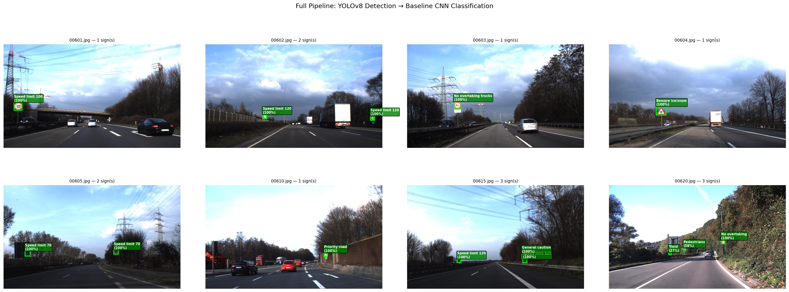
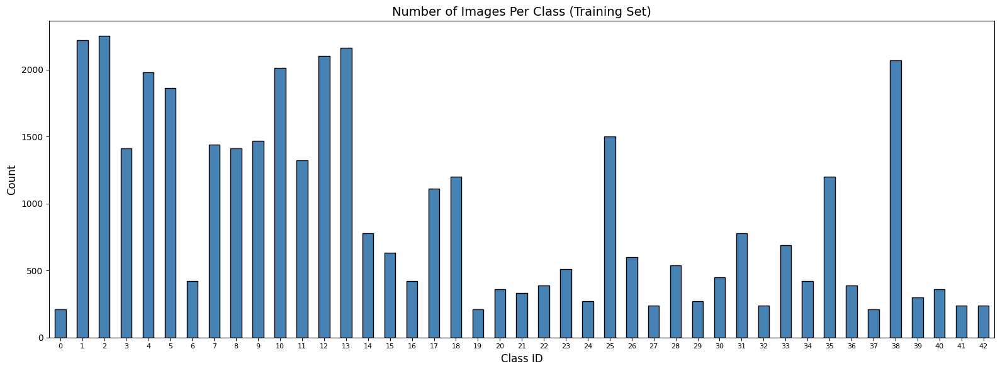
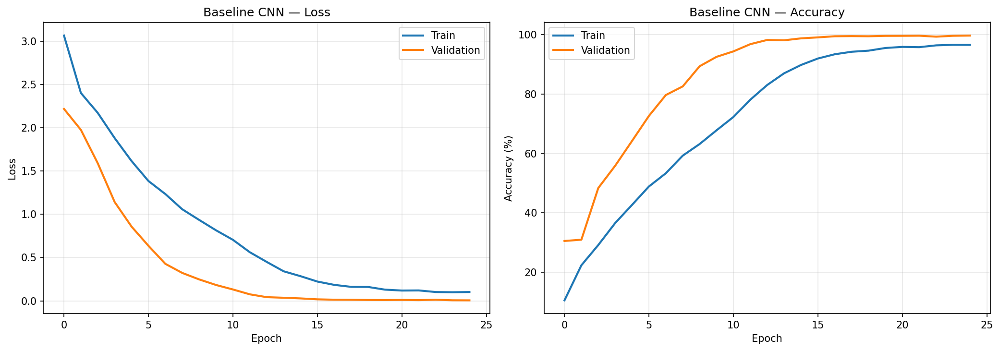
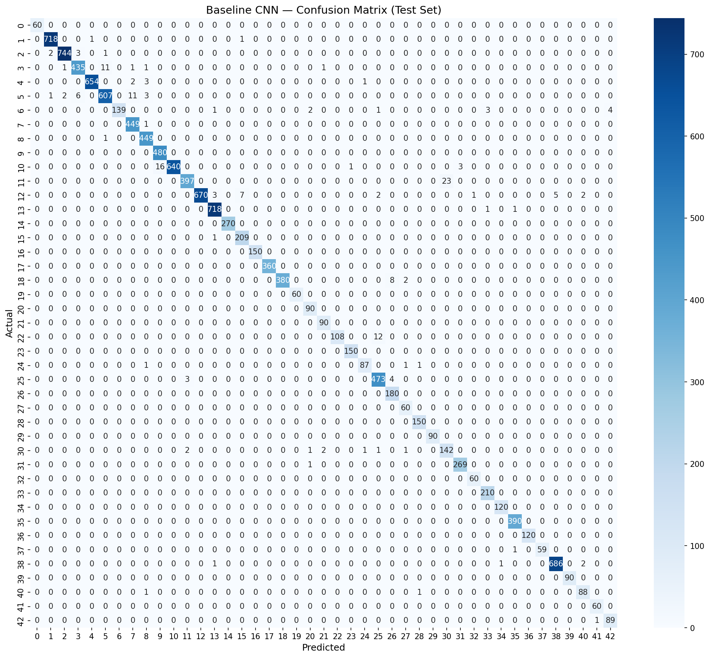

# Traffic Sign Detection and Recognition

A complete deep learning pipeline for detecting and recognising traffic signs in real-world road images, built with **PyTorch** and **YOLOv8**.

The system uses a **two-stage architecture**: YOLOv8 detects traffic signs in full dashcam scenes, then a custom CNN classifies each detected sign into one of 43 categories — achieving **98.23% classification accuracy** and **91.42% detection mAP@50**.



---

## Key Results

### Classification (GTSRB Dataset)

| Model | Test Accuracy | Parameters | Notes |
|-------|:------------:|:----------:|-------|
| **Baseline CNN** | **98.23%** | ~1.2M | Custom 3-block CNN — best performer |
| ResNet-18 v2 | 97.51% | ~11.2M | Transfer learning, differential LR |
| MobileNetV2 v2 | 95.96% | ~2.3M | Transfer learning, differential LR |
| ResNet-18 v1 | 92.60% | ~11.2M | Too many frozen layers |
| MobileNetV2 v1 | 80.84% | ~2.3M | Too many frozen layers |

### Detection (GTSDB Dataset)

| Model | mAP@50 | Precision | Recall | Notes |
|-------|:------:|:---------:|:------:|-------|
| **YOLOv8n (1-class)** | **91.42%** | 87.57% | 83.66% | Single-class detection |
| YOLOv8n (43-class) | 5.77% | 20.27% | 11.24% | Too many classes for 600 images |

### Key Findings

- **Custom CNN outperformed transfer learning** on GTSRB — the domain gap between ImageNet (natural images at 224×224) and traffic signs (symbols at ~50×50px) made pretrained features less effective than task-specific ones.
- **Freezing strategy matters** — unfreezing more layers with differential learning rates improved ResNet-18 from 92.60% → 97.51% and MobileNetV2 from 80.84% → 95.96%.
- **Single-class detection dramatically outperformed 43-class detection** (91.42% vs 5.77% mAP@50) — with only 600 training images, asking YOLO to learn 43 classes left some with just 1–2 examples. Simplifying to "find any traffic sign" and deferring classification to the CNN was the correct architectural decision.

---

## Architecture

```
┌─────────────────┐     ┌──────────────────┐     ┌─────────────────┐
│   Input Image   │────▶│  YOLOv8 Detector  │────▶│  Crop Detected  │
│  (1360 × 800)   │     │  (Single-class)   │     │     Regions     │
└─────────────────┘     └──────────────────┘     └────────┬────────┘
                                                          │
                                                          ▼
                                                ┌──────────────────┐
                                                │   CLAHE + Resize │
                                                │    (48 × 48)     │
                                                └────────┬─────────┘
                                                         │
                                                         ▼
                                                ┌──────────────────┐     ┌──────────────┐
                                                │  Baseline CNN    │────▶│  Class Label  │
                                                │  Classifier      │     │  + Confidence │
                                                │  (43 classes)    │     └──────────────┘
                                                └──────────────────┘
```

---

## Project Structure

```
traffic-sign-project/
│
├── README.md
├── requirements.txt
├── .gitignore
├── demo.py                         # Run full pipeline on any image
│
├── src/
│   ├── data/
│   │   ├── dataset.py              # PyTorch Dataset class for GTSRB
│   │   └── transforms.py           # Augmentation and preprocessing
│   │
│   ├── models/
│   │   ├── baseline_cnn.py         # Custom 3-block CNN (best model)
│   │   ├── resnet_transfer.py      # ResNet-18 transfer learning
│   │   └── mobilenet_transfer.py   # MobileNetV2 transfer learning
│   │
│   ├── training/
│   │   ├── trainer.py              # Training loop with early stopping
│   │   └── metrics.py              # Evaluation and visualisation
│   │
│   └── pipeline/
│       └── detect_and_classify.py  # Full two-stage pipeline
│
├── notebooks/
│   ├── 01_eda.ipynb                # Exploratory data analysis and Model training and comparison
│   └── 02_detection.ipynb          # YOLOv8 detection + pipeline
│
├── configs/
│   └── config.yaml                 # All hyperparameters
│
├── assets/                         # Images for README
│   ├── full_pipeline_results.png
│   ├── class_distribution.png
│   ├── training_curves.png
│   └── confusion_matrix.png
│
└── weights/                        # Trained model weights (see note below)
    ├── best_baseline_cnn.pth
    └── yolov8n_single_class.pt
```

> **Note:** Model weights are not included in the repository due to file size. See [Training](#training) to reproduce.

---

## Datasets

### GTSRB (Classification)
- **Source:** [Kaggle — GTSRB](https://www.kaggle.com/datasets/meowmeowmeowmeowmeow/gtsrb-german-traffic-sign)
- 39,209 training images, 12,630 test images
- 43 classes of German traffic signs
- Images range from 25×25 to 243×225 pixels

### GTSDB (Detection)
- **Source:** [Kaggle — GTSDB](https://www.kaggle.com/datasets/icebearogo/german-traffic-sign-detection-gtsdb-dataset)
- 600 training images, 300 test images
- Full dashcam scene images (1360×800 pixels)
- Bounding box annotations in YOLO format

---

## Installation

```bash
# Clone the repository
git clone https://github.com/pedramebd/traffic-sign-detection-recognition.git
cd traffic-sign-detection-recognition

# Install dependencies
pip install -r requirements.txt

# For GPU support (recommended)
pip install torch torchvision torchaudio --index-url https://download.pytorch.org/whl/cu124
```

---

## Quick Start

### Run the full pipeline on an image

```bash
python demo.py --image path/to/dashcam_image.jpg
```

### Train classification models

```bash
# See the training notebook for full details
jupyter notebook notebooks/01_eda.ipynb
```

### Train detection model

```bash
# See the detection notebook for full details
jupyter notebook notebooks/02_detection.ipynb
```

---

## Training

### Classification

All models were trained on an NVIDIA RTX 4060 (8GB VRAM):

- **Input size:** 48×48 pixels
- **Batch size:** 64
- **Optimiser:** Adam (lr=0.001 for baseline, differential LR for transfer learning)
- **Loss:** Weighted CrossEntropyLoss (to handle 10.7× class imbalance)
- **Augmentation:** Random rotation (±15°), affine shifts, colour jitter
- **Preprocessing:** CLAHE contrast enhancement, ImageNet normalisation
- **Early stopping:** Patience of 5 epochs on validation loss

### Detection

- **Model:** YOLOv8n (nano) pretrained on COCO
- **Input size:** 640×640
- **Epochs:** 80 (with patience of 15)
- **Strategy:** Single-class detection ("traffic_sign") rather than 43-class

---

## Sample Outputs

### Class Distribution (10.7× imbalance)


### Baseline CNN Training Curves


### Confusion Matrix


### Full Pipeline Detections


---

## Technologies

- **Python 3.12**
- **PyTorch 2.6** — model building and training
- **Ultralytics YOLOv8** — object detection
- **OpenCV** — image preprocessing and CLAHE
- **scikit-learn** — evaluation metrics and train/val splitting
- **matplotlib / seaborn** — visualisation

---

## Acknowledgements

- [GTSRB Benchmark](https://benchmark.ini.rub.de/) — Institut für Neuroinformatik, Ruhr-Universität Bochum
- [GTSDB Benchmark](https://benchmark.ini.rub.de/?section=gtsdb) — Houben et al., IJCNN 2013
- [Ultralytics YOLOv8](https://github.com/ultralytics/ultralytics)

---

## License

This project is for educational and research purposes. The datasets are subject to their original licences (CC0 for GTSRB, Attribution-NonCommercial 4.0 for GTSDB).
